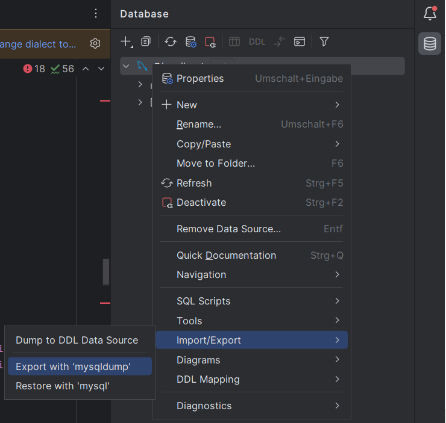
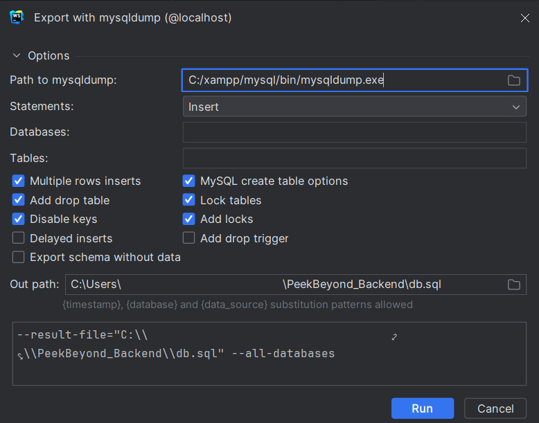
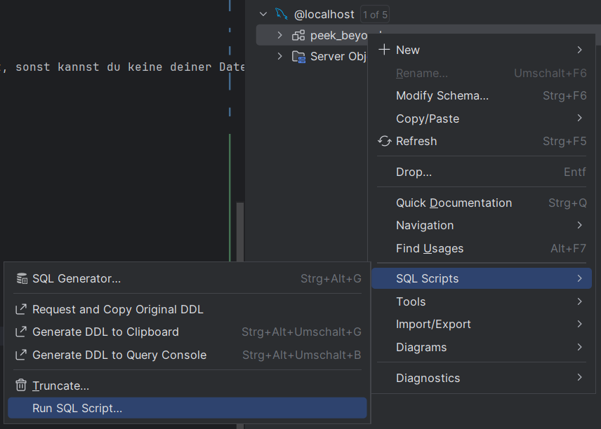
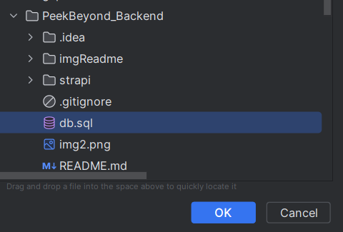

# Strapi
Im [README](strapi/README.md) von Strapi steht das Setup beschrieben
## Types
### Collection Type
Hier können Inhalte definiert werden die öfter als einmal benötigt werden. (vgl class in html)
Muss im Singular geschrieben werden, weil strapi es automatisch im plural verwendet. User -> Users

### Single Type
Nomen est omen, da können Sachen definiert werden, die nur einmal vorhanden sind (vgl id in html), also beispielsweise Seiten also eine einzelne Page

### Components
Eine Sammlung von Feldern. Es können Inhalte aber nicht gespeichert also angelegt werden. Dient als Interface in den Types, wenn es öfters gebraucht wird.
Also ein Überschriftenfeld (Überschrift (text) + Subüberschrift (text)).

## API
Zum Abfragen der Inhalte schaut des dann so aus: 'http://localhost:1337/api/entries' (all) oder  'http://localhost:1337/api/entries/1' (one by id)

## NOTA BENE
- Types können nur erstellt werden, wenn der Server im Dev-Modus gestartet worden ist.
- Immer nach dem Erstellen von einem Type ```npm run strapi ts:generate-types``` laufen lassen und den dev-server neu starten. (nur bei TS, ist noch ein bug rip)
- Man muss dann einzelne Typen in Settings->Roles für die Öffentlichkeit zuerst einmal freigeben, um von außen darauf zugreifen zu können. 
- Nach dem Löschen von Types den dist Ordner löschen und den Server neu starten. (dort bleiben die Sachen fürs Adminpanel nämlich noch hinterlegt)

# Setup
## Dev
- [Node (npm)](https://nodejs.org/en/download/current)
- MySQL Server (lokal)
  - [Tutorial](https://www.youtube.com/watch?v=u96rVINbAUI)
  - Notiere dir bitte auch die Zugangsdaten, die du für dein Setup eingegeben hast, sonst kannst du keine deiner Datenbanken verwalten. (Nicht auf dieses Projekt bezogen)
- [Xampp](https://www.apachefriends.org/de/download.html) für _mysqldump.exe_ (falls du die exe schon woanders hast sind deine Pfade unten auch anders und du brauchst xampp nicht installieren)

## DB 
Bitte beachte beim anlegen der Datenbank folgende Einstellungen:
- Port: **3306**
- DB Name: **peek_beyond**
- DB Username: **root**
- DB PW: **root**

### Export
#### Default
```bash
C:\xampp\mysql\bin\mysqldump -u root -p peek_beyond -r "C:\...\db.sql"
```
Wenn du nach dem PW gefragt wirst einfach "root" eingeben

##### WebStorm
Verbinde dich mit den Zugangsdaten zur Datenbank



### Import
#### Default
```shell
C:\xampp\mysql\bin\mysql -u root -p peek_beyond;
```
Dann ist man in der DB
Kopiere dass dann rein: (natürlich mit deinem Pfad zum Projekt lol)
```
source "C:\...\db.sql"
```

#### WebStorm
Verbinde dich mit den Zugangsdaten zur Datenbank



Nach "Ok" werden alle Inhalte importiert! 